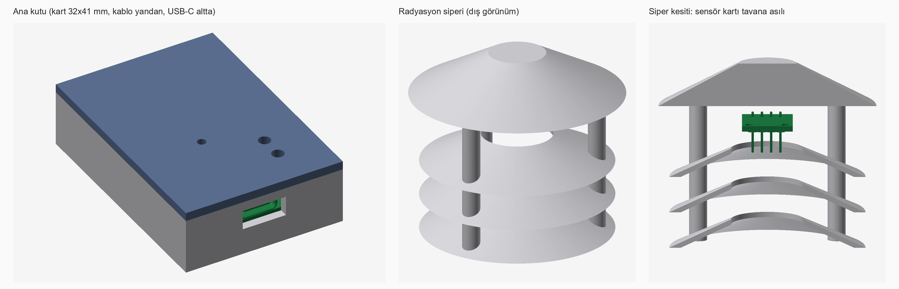
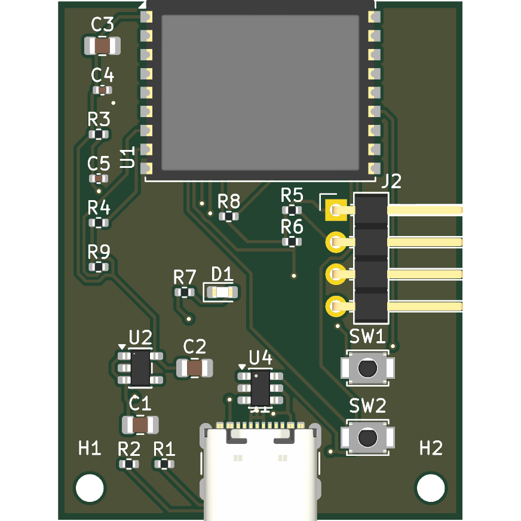
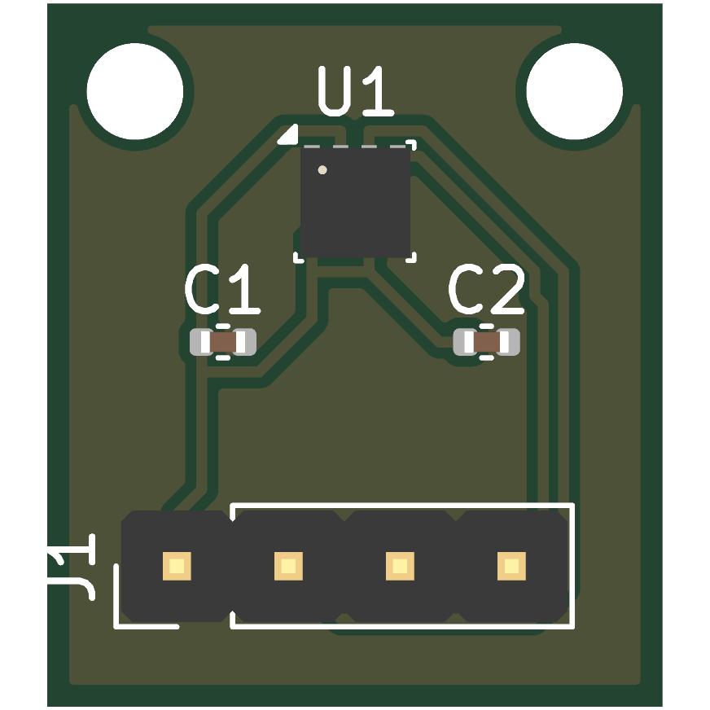

# Hava İstasyonu

[English](README.md) · **Türkçe**

Dışarıda sıcaklık, nem ve basıncı ölçen, ölçümü Wi-Fi ile internete yayınlayan ve bir tarayıcı sayfasında gösteren bir cihaz.

## Ne yaptık

### 1. İki kart
| Ana kart (32x41 mm) | Sensör kartı (14x16 mm) |
|---|---|
|  |  |

- **Ana kart:** ESP32-C3 (Wi-Fi'li işlemci modülü), USB-C, 3,3 V regülatör, reset ve boot butonları, durum LED'i ve sensör için 4 pinli konnektör. Kutuya 2 M2 vida ile sabitlenir.
- **Sensör kartı:** BME280 (sıcaklık, nem, basınç) ve konnektör. Ana karttan ayrı ve kabloyla bağlı, çünkü işlemci ve regülatör ısınır, yanındaki sensör sıcaklığı yüksek ölçerdi.
- **Tasarım kararları:** Anten kartın kenarından dışarı taşıyor (üreticinin önerisi). ESP32-C3'ün açılış modunu belirleyen IO2 ve IO8 pinlerine pull-up direnci eklendi (datasheet denetiminde bulundu). Konnektör dik açılı, kablo yandan çıkıyor ve kutu alçak kalıyor. Konnektörün ilk üç pini yaygın 3 telli sensör modüllerinin (VCC, DATA, GND) sırasına denk geliyor.
- **Araçlar:** Devre SKiDL ile Python'da tanımlandı ve KiCad şematiğine dönüştürüldü ([ana kart](pcb/main/hava_sematik.pdf), [sensör kartı](pcb/sensor/hava_sematik.pdf)); kartlar KiCad'de şematiğin netlistinden kuruldu, bakır yollar Freerouting ile otomatik yönlendirildi. Sonuç: elektriksel kural kontrolü (ERC) 0 hata, tasarım kuralı kontrolü (DRC) 0 ihlal, şematik ile kart birebir uyuşuyor.

### 2. Kutu ve radyasyon siperi
- **Ana kutu (37x54x15 mm):** USB-C açıklığı, kablo çıkışı, buton ve LED delikleri.
- **Radyasyon siperi (60 mm çap, 52 mm yükseklik):** Üç konik plaka ve tavan; güneş sensörü ısıtmasın, hava geçsin. Sensör kartı tavana asılır, kablo alttan çıkar.
- FreeCAD'de betikle üretildi, ölçüler doğrudan karttan okunuyor. KiCad'in parçalı 3D kart modeli kutuyla kesiştirilerek **çakışma kontrolü** yapıldı: çakışma yok.

### 3. Firmware
ESP-IDF ile C dilinde. Wi-Fi'ye bağlanır, sensörü okur, ölçümü JSON olarak MQTT ile (WebSocket + TLS, 443 portu) yayınlar. Sensör olarak BME280 (ana kart) ya da alternatif olarak DHT22 seçilebilir. BME280 sürücüsü, ölçüm hesabı ve DHT22 kod çözme kodu yazıldı.

### 4. Web sayfası
Tek dosyalık (`web/index.html`) sayfa: aynı MQTT konusunu dinler, sıcaklık, nem ve basıncı gösterir, yanında meteoroloji servisinin değerini karşılaştırma için sunar.

### 5. Nasıl denedik
- **Datasheet denetimi (3 tur):** Parçaların pin ve devre bilgileri datasheet'lerle karşılaştırıldı; bulunan hatalar (bağlantısız strapping pinleri, eksik kondansatör) düzeltildi.
- **Bilgisayarda testler:** BME280 hesabı Bosch'un datasheet örneği ve referans formülle karşılaştırıldı; BME280 sürücüsü sanal bir sensöre karşı çalıştırıldı; DHT22 kod çözme datasheet örnekleriyle denendi.
- **Simülasyon (Wokwi):** Simülatörde BME280 bulunmadığı için ESP32-S3 ve sanal DHT22 ile ölçüm alındı, MQTT ile yayınlandı, web sayfasında görüldü. Negatif sıcaklık (−17,9 °C) ve yaklaşık 3 dakikalık kesintisiz çalışma denendi.
- **Süreç:** Tasarım ve kod LLM (Claude) ile üretildi; her adım bu kontrollerle denendi; denemelerde bulunan hatalar düzeltildi.
- **Sınır:** Gerçek donanımda henüz denenmedi.

## Klasörler
| Klasör | İçerik |
|---|---|
| `pcb/main`, `pcb/sensor` | Ana kart ve sensör kartı (KiCad, üretim betikleri) |
| `case` | Kutu ve radyasyon siperi (FreeCAD betikleri, görüntüler) |
| `firmware` | ESP-IDF projesi ve testler |
| `web` | Tarayıcı sayfası |
| `docs` | Tasarım belgeleri (`tasarim/`: gereksinim, parça seçimi, datasheet denetimleri, pin tablosu) ve çalıştırma talimatı (`CALISTIRMA.md`) |
